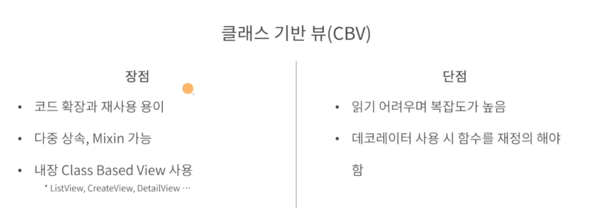

# Django_ZIP

가상환경 공간 생성
```cmd
python -m venv venv // 가상환경 공간 생성
```

가상환경에 접속
```cmd
.\venv\Scripts\activate // 가상환경에 접속
```

pip자체를 업그레이드
```cmd
pip install --upgrade pip // pip자체를 업그레이드
```

장고설치 
```cmd
pip install django 
```

장고 프로젝트 생성
```cmd
django-admin startproject config .
```

서버실행
```cmd
python manage.py runserver
```

장고 앱생성
```cmd
django-admin startapp 앱이름
```

가상
## 장고 특징
- Python 웹 프레임워크
- MTV 디자인 패턴
- 오픈 소스
- 앱(App)단위로 프로젝트 구성
    - 앱이란 장고 프로젝트 구성하는 모듈을 의미
    - 장고 프로젝트 관점에서 관련된 기능을 모아둔 파이썬 파일
    - 앱 이름은 영문 복수형으로 생성
    - 

## 장고 핵심 요소


### ORM
- Object-Relational Mapping
- 객체지향 언어와 관계형 데이터베이스를 연결해주는 기술
- 장고 자체에 ORM이라는 기술이 내장되어있음
- Models, QuerySet API 등이 ORM에 포함

### Templates
- 자체 템플릿 시스템으로 디자인과 로직을 분리하여 독립적 개발 가능
- HTML 파일을 분리하여 재사용, 체계적으로 관리할 수 있음
- HTML 파일에 include,if,for 등 템플릿 언어를 사용가능
  
### Forms
- 데이터의 유효성 검사
- 구성하고자 하는 형태 렌더링(HTML태그 생성)
- 제출하는 폼 데이터의 변경 확인

### Authentication
- 시스템 인증과 권한부여 기본 제공
- 인증과 권한의 차이
- 인증: 사용자가 누구인지 판별
- 권한: 인증된 사용자가 어떤 일을 할 수 있는지 결정
- 구성요소 : 사용자, 권한, 그룹(권한을 둘 이상 적용하는 방법)

### Admin
- 관리자 인터페이스 제공
- 등록된 모델의 기본적인 조회,추가,수정,삭제 기능제공(CRUD)
- 사용자 관리, 사용자 그룹관리, 사용자 별 권한 기본 제공

### Internationalization(국제화)
- 동일한 소스코드로 텍스트의 번역,날짜/시간/숫자의 포맷, 타임존의 지정 등 가 같은 다국어 환경 제공
- 개발자와 템플릿 작성자는 언어 및 문화에 맞게 번역하거나 형식 지정 가능
- 특정 사용자의 기본 설정에 따라 웹 앱을 현지화화


### Security
- 대표적인 보안사항 기능 제공
  - CSRF(교차 사이트 요청 위조)보호
  - 호스트 헤더 유효성 검사
  - SQL 주입 보호
  - 리퍼러 정책
  - XSS(교차 사이트 스크립팅)보호
  - 교차 출저정책
  - 클릭재킹 방지
  - 세션 보안
  - SSL/HTTPS

## 장고의 기본 구조
MTV 디자인 패턴


Model과 Template는 선택사항이다

View만으로도 요청받고 응답할수도있다

## manage.py
 -> 장고한테 명령어를 쓸수있도록 하는 파이썬 파일이다(직접적으로 건들지는 않음)

## config.py 
-> 실무에서 현업을 할때에는 유지보수가 유리하게 config라는 이름을 붙힘


명령어로만든 폴더나 파일들은 자신이 임의로 건들면 안된다.
-  ex) manage.py config.py

## config.py 안에
__init__.py가 있다는것은 파이썬 패키지다 라고 약속되어있는 것이다

## settings.py
장고가 실행되어짐에 있어서 설정값들이 다 들어가있다

장고 프로젝트가 실행될때 필요한 변수, 값들이 들어와있다


## urls.py
urls.py 파일 안에 url이 정이가 되어야 view가 그 코드를 받아 실행할수있다

## models.py, migrations
데이터를 정의하고 정의한 데이터를 기반으로 데이터베이스를 만들때 기록을 남기는것을 migrations폴더

## admin.py
관리자 인터페이스를 제공해주는 파일

## views.py
컨트롤러 역할을하는 비즈니스로직이다.

# ※앱을 만들면 무조건 앱을 추가해주어야한다


settings.py 파일에 있는 
저부분에 앱을 무조건 추가시키고 ,(콤마) 까지 붙혀야한다

## http의 개념 

 - http는 컴퓨터가 서로 데이터를 주고받는 방법
 - http요청을 하면 브라우저는 서버로 응답을 하고 서버는 응답을 브라우저에게 함


# 데이터베이스와 ORM 완벽 이해하기

## 1. 데이터베이스와 ORM 이해하기
### 데이터베이스
 - 공유의 목적으로 통합관리되는 자료의 집합
 - 논리적으로 연관된 하나 이상의 자료의 모음으로 내용을 구조화하여 검색과 갱신의 효율화한것
 - " 중복을 없애고 자료를 구조화하여 기억시켜 놓는 자료의 집합체 "


### 데이터베이스 관리 리스템
- 데이터베이스 내의 데이터를 접근 할 수 있도록 해주는 소프트웨어
- 사용자 또는 다른 프로그램의 요구를 처리하고 응답하여 데이터를 사용 할 수 있도록 함
- 일반적으로 DB라고 부름


### DataBase Tool
- 데이터베이스에 관리를 위한 도구
- 툴을 활용하여 테이블이나 데이터를 조작
- GUI제공


ORM -> 객체와 관계를 매핑시켜주는것


ORM 장점단점
- 장점
- 생산성 향상, 비즈니스 로직 집중
- 재사용 및 유지보수 용이
- DBMS 종속되지 않음

- 단점
- 프로젝트가 복잡한 경우 난이도 상승
- Raw Query보다 성능이 낮음
  


  Model,Field가 데이터베이스의 구조 테이블의 구조를 잡는 역할을 한다

## 2. Django Models 이해하기


## 3. 인스타그램 게시글로 이해하는 Models

**모델링**
- 저장하고자하는 데이터를 모델로 정의하는것


## 4. 인스타그램 댓글로 이해하는 Models 관계 구성


## QuerySet API와 Admin 개발하기
Query: DB에 정보를 요청하는것
QuerySet: DB에서 전달 받은 객체의 목록
QuerySetAPI: DB에 요쳥하기 위한 인터페이스


# Template와 View 정복하기

Views를 만드는 방법

- FBV : Function Basesd Views
- CBV : Class Based Views


FBV 는 일회성, 특수 목적이 있는 View에 적합



CBV는 일반적인 생성,조회,수정,삭제 등의 View에 적합

FBV와 CBV는 좋고 나쁘고를 판단하기 보다 
상황에 적합한 방식을 선택하는 것이 바람직하다.


